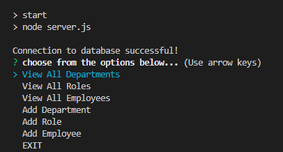

# Employee Tracker

  # 

  ## Description
  Creates an interface that allows non-developers to easily view and interact with information in a database of departments, roles and employees
  

  ## Table of Contents
  - [Installation](#install)
  - [Usage](#usage)
  - [License](#license)
  - [Questions](#questions)

  
  ## Installation
  - 'npm i' to install dependencies
  - Change login credentials in server.js file
  - Login to mysql and run 'source db/schema.sql'
  - Exit
  - Run 'npm start'
  
  ## Usage
  
  
  ## License 
  MIT
  
  ## Questions
  How to reach me...
  - GitHub: https://github.com/fernandot10
  - Email: fernando.t10@outlook.com

  